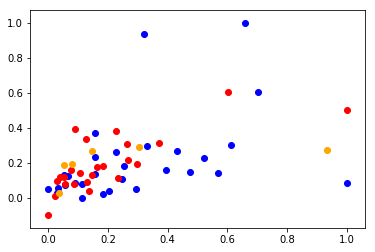

# Here's some data!

### 1. Import the data. It's stored in a file called 'movie_data_detailed.xlsx'.


```python
import pandas as pd
%matplotlib inline
```


```python
df = pd.read_excel('movie_data_detailed.xlsx')
df.head()
```


<div>
<style scoped>
    .dataframe tbody tr th:only-of-type {
        vertical-align: middle;
    }

    .dataframe tbody tr th {
        vertical-align: top;
    }

    .dataframe thead th {
        text-align: right;
    }
</style>
<table border="1" class="dataframe">
  <thead>
    <tr style="text-align: right;">
      <th></th>
      <th>budget</th>
      <th>domgross</th>
      <th>title</th>
      <th>Response_Json</th>
      <th>Year</th>
      <th>imdbRating</th>
      <th>Metascore</th>
      <th>imdbVotes</th>
    </tr>
  </thead>
  <tbody>
    <tr>
      <th>0</th>
      <td>13000000</td>
      <td>25682380</td>
      <td>21 &amp;amp; Over</td>
      <td>NaN</td>
      <td>2008.0</td>
      <td>6.8</td>
      <td>48.0</td>
      <td>206513.0</td>
    </tr>
    <tr>
      <th>1</th>
      <td>45658735</td>
      <td>13414714</td>
      <td>Dredd 3D</td>
      <td>NaN</td>
      <td>2012.0</td>
      <td>NaN</td>
      <td>NaN</td>
      <td>NaN</td>
    </tr>
    <tr>
      <th>2</th>
      <td>20000000</td>
      <td>53107035</td>
      <td>12 Years a Slave</td>
      <td>NaN</td>
      <td>2013.0</td>
      <td>8.1</td>
      <td>96.0</td>
      <td>537525.0</td>
    </tr>
    <tr>
      <th>3</th>
      <td>61000000</td>
      <td>75612460</td>
      <td>2 Guns</td>
      <td>NaN</td>
      <td>2013.0</td>
      <td>6.7</td>
      <td>55.0</td>
      <td>173726.0</td>
    </tr>
    <tr>
      <th>4</th>
      <td>40000000</td>
      <td>95020213</td>
      <td>42</td>
      <td>NaN</td>
      <td>2013.0</td>
      <td>7.5</td>
      <td>62.0</td>
      <td>74170.0</td>
    </tr>
  </tbody>
</table>
</div>


### 2. Fill all the null values with zero.


```python
df = df.fillna(value=0)
df.head()
```


<div>
<style scoped>
    .dataframe tbody tr th:only-of-type {
        vertical-align: middle;
    }

    .dataframe tbody tr th {
        vertical-align: top;
    }

    .dataframe thead th {
        text-align: right;
    }
</style>
<table border="1" class="dataframe">
  <thead>
    <tr style="text-align: right;">
      <th></th>
      <th>budget</th>
      <th>domgross</th>
      <th>title</th>
      <th>Response_Json</th>
      <th>Year</th>
      <th>imdbRating</th>
      <th>Metascore</th>
      <th>imdbVotes</th>
    </tr>
  </thead>
  <tbody>
    <tr>
      <th>0</th>
      <td>13000000</td>
      <td>25682380</td>
      <td>21 &amp;amp; Over</td>
      <td>0.0</td>
      <td>2008.0</td>
      <td>6.8</td>
      <td>48.0</td>
      <td>206513.0</td>
    </tr>
    <tr>
      <th>1</th>
      <td>45658735</td>
      <td>13414714</td>
      <td>Dredd 3D</td>
      <td>0.0</td>
      <td>2012.0</td>
      <td>0.0</td>
      <td>0.0</td>
      <td>0.0</td>
    </tr>
    <tr>
      <th>2</th>
      <td>20000000</td>
      <td>53107035</td>
      <td>12 Years a Slave</td>
      <td>0.0</td>
      <td>2013.0</td>
      <td>8.1</td>
      <td>96.0</td>
      <td>537525.0</td>
    </tr>
    <tr>
      <th>3</th>
      <td>61000000</td>
      <td>75612460</td>
      <td>2 Guns</td>
      <td>0.0</td>
      <td>2013.0</td>
      <td>6.7</td>
      <td>55.0</td>
      <td>173726.0</td>
    </tr>
    <tr>
      <th>4</th>
      <td>40000000</td>
      <td>95020213</td>
      <td>42</td>
      <td>0.0</td>
      <td>2013.0</td>
      <td>7.5</td>
      <td>62.0</td>
      <td>74170.0</td>
    </tr>
  </tbody>
</table>
</div>


### 3. Normalize the data so that all features have a minimum of zero and a maximum of one.


```python
for col in df.columns:
    if col == 'title':
        continue
    col_min = df[col].min()
    col_max = df[col].max()
    df[col] = (df[col] - col_min) / (col_max-col_min)
df.head()
```


<div>
<style scoped>
    .dataframe tbody tr th:only-of-type {
        vertical-align: middle;
    }

    .dataframe tbody tr th {
        vertical-align: top;
    }

    .dataframe thead th {
        text-align: right;
    }
</style>
<table border="1" class="dataframe">
  <thead>
    <tr style="text-align: right;">
      <th></th>
      <th>budget</th>
      <th>domgross</th>
      <th>title</th>
      <th>Response_Json</th>
      <th>Year</th>
      <th>imdbRating</th>
      <th>Metascore</th>
      <th>imdbVotes</th>
    </tr>
  </thead>
  <tbody>
    <tr>
      <th>0</th>
      <td>0.034169</td>
      <td>0.055325</td>
      <td>21 &amp;amp; Over</td>
      <td>NaN</td>
      <td>0.997516</td>
      <td>0.839506</td>
      <td>0.500000</td>
      <td>0.384192</td>
    </tr>
    <tr>
      <th>1</th>
      <td>0.182956</td>
      <td>0.023779</td>
      <td>Dredd 3D</td>
      <td>NaN</td>
      <td>0.999503</td>
      <td>0.000000</td>
      <td>0.000000</td>
      <td>0.000000</td>
    </tr>
    <tr>
      <th>2</th>
      <td>0.066059</td>
      <td>0.125847</td>
      <td>12 Years a Slave</td>
      <td>NaN</td>
      <td>1.000000</td>
      <td>1.000000</td>
      <td>1.000000</td>
      <td>1.000000</td>
    </tr>
    <tr>
      <th>3</th>
      <td>0.252847</td>
      <td>0.183719</td>
      <td>2 Guns</td>
      <td>NaN</td>
      <td>1.000000</td>
      <td>0.827160</td>
      <td>0.572917</td>
      <td>0.323196</td>
    </tr>
    <tr>
      <th>4</th>
      <td>0.157175</td>
      <td>0.233625</td>
      <td>42</td>
      <td>NaN</td>
      <td>1.000000</td>
      <td>0.925926</td>
      <td>0.645833</td>
      <td>0.137984</td>
    </tr>
  </tbody>
</table>
</div>


### 4. Define 4 variables: X_train, Y_train, X_test, Y_test using a 80-20 split for train and test data. X should be a matrix of data features predicting y, Domestic Gross Sales.  Use random_state=42 for consistency.


```python
from sklearn.model_selection import train_test_split
```


```python
X = df[['budget', 'Year', 'imdbRating',
       'Metascore', 'imdbVotes']]
y = df['domgross']
```


```python
X_train, X_test, y_train, y_test = train_test_split(X, y, test_size=.2, random_state=42)
```

### 5. Import import sklearn.linear_model.LinearRegression
Create an instance of the LinearRegression class.
Then use the fit method to train a model according to the data.


```python
import sklearn.linear_model as linreg
```


```python
ols = linreg.LinearRegression() #Ordinary Least Squares Regressor
```


```python
X_train.head()
```


<div>
<style scoped>
    .dataframe tbody tr th:only-of-type {
        vertical-align: middle;
    }

    .dataframe tbody tr th {
        vertical-align: top;
    }

    .dataframe thead th {
        text-align: right;
    }
</style>
<table border="1" class="dataframe">
  <thead>
    <tr style="text-align: right;">
      <th></th>
      <th>budget</th>
      <th>Year</th>
      <th>imdbRating</th>
      <th>Metascore</th>
      <th>imdbVotes</th>
    </tr>
  </thead>
  <tbody>
    <tr>
      <th>28</th>
      <td>0.248292</td>
      <td>1.000000</td>
      <td>0.827160</td>
      <td>0.416667</td>
      <td>0.351325</td>
    </tr>
    <tr>
      <th>24</th>
      <td>0.052392</td>
      <td>1.000000</td>
      <td>0.802469</td>
      <td>0.593750</td>
      <td>0.260341</td>
    </tr>
    <tr>
      <th>12</th>
      <td>0.202733</td>
      <td>1.000000</td>
      <td>0.765432</td>
      <td>0.541667</td>
      <td>0.141391</td>
    </tr>
    <tr>
      <th>0</th>
      <td>0.034169</td>
      <td>0.997516</td>
      <td>0.839506</td>
      <td>0.500000</td>
      <td>0.384192</td>
    </tr>
    <tr>
      <th>4</th>
      <td>0.157175</td>
      <td>1.000000</td>
      <td>0.925926</td>
      <td>0.645833</td>
      <td>0.137984</td>
    </tr>
  </tbody>
</table>
</div>


```python
ols.fit(X_train, y_train)
```


    LinearRegression(copy_X=True, fit_intercept=True, n_jobs=1, normalize=False)


```python
ols.intercept_
```


    0.3164911350265636


```python
ols.coef_
```


    array([ 0.40930198, -0.38061493, -0.09778566,  0.27818131,  0.19229047])


```python
ols.predict(X_test)
```


    array([0.29206275, 0.19644405, 0.18835893, 0.27380443, 0.03107804,
           0.26687821])


### 6. Scatter Plot <a id="scatter"></a>  
Create a Scatter Plot of the budget and  Domestic Gross (domgross) along with your model's predictions.


```python
%matplotlib inline
import matplotlib.pyplot as plt
```


```python
plt.scatter(df.budget, df.domgross, color='blue')
plt.scatter(y_train, ols.predict(X_train), color='red')
plt.scatter(y_test, ols.predict(X_test), color='orange')
```


    <matplotlib.collections.PathCollection at 0x1a1bbeb2e8>





### 7. Calculate the RSS for both the train and test sets.
Define a function called rss(y,y_hat). Call it on the train and test sets.


```python
def rss(y, y_hat):
    return sum((y_hat - y)**2)
```


```python
print('RSS Training: {}'.format( rss(y_train, ols.predict(X_train)) ))
print('RSS Test: {}'.format( rss(y_test, ols.predict(X_test)) ))
```

    RSS Training: 0.48912789025753006
    RSS Test: 0.4848084478649039

